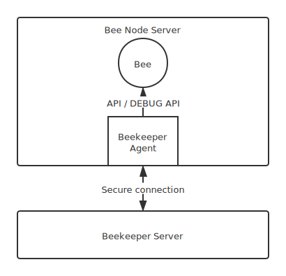

# Beekeeper Agent

Beekeeper Agent 是一个简单的探针程序。
主要目的是为 `Bee` 的 `API` 和`DEBUG API` 加上授权验证。

## 背景

默认情况下，当运行 `Bee` 时:
*	API 运行在 http://localhost:1633 ， 主要用作上传下载数据等功能。
*	DEBUG API 运行在 http://localhost:1635 ， 主要用作管理节点。

为了安全起见，这两个端口不应该暴露在公网，默认情况下公网也确实无法访问，只能手工登录到服务器里面访问。

但如果你维护了大量的节点，手工维护或者通过简单的脚本维护都会举步维艰，这个时候一个统一的[节点管理平台(beekeeper.one)](https://beekeeper.one) 就显得尤为重要。

那如何将`API`和`DEBUG API` 暴露给`beekeeper.one`，而又不暴露给公网，保证节点的安全呢？

`Beekeeper Agent` 就是完成这件事的。



## 安装

`Beekeeper Agent` 支持linux，darwin, windows.

`git clone https://github.com/beekeeperone/agent.git`

git checkout [{release-tag}](https://github.com/beekeeperone/agent/releases)

`make linux`

或者

`make darwin`

或者

`make windows`

## 准备工作

1, 确保 `Swarm Bee` 节点服务器拥有公网IP，并且安全策略至少开放一个可用的端口给 `Beekeeper Agent`， 默认为 `50505`。

2, 在 beekeeper.one 个人中心获取token.

3, 安装 Bee 节点: https://docs.ethswarm.org/docs/installation/install

4, 检查 Bee 节点是否运行正常： https://docs.ethswarm.org/docs/installation/install#check-bee-is-working

## 运行

重命名文件:

`mv bee-agent-linux-amd64 bee-agent` 

> 以Linux为例，平台不同，生成的文件也不同.

然后运行:

```bash
./bee-agent run \\
	--server https://beekeeper.one \\
	--token {yourtoken} \\
	--api http://localhost:1635 \\
	--debug-api http://localhost:1635 \\
	--port {agentport}
```

* --server:   https://beekeeper.one
* --token: 你在 [个人中心](https://beekeeper.one) 获取到的token, 请不要随意泄漏.
* --api:  默认是 http://localhost:1635， 如果没修改，可以不指定.
* --debug-api: 默认是 http://localhost:1635， 如果没修改，可以不指定.
* --port: 暴露给 beekeeper.one 安全连接的端口， 默认 `50505`.

如果不使用 beekeeper.one，只需额外指定 `--disable-register` 即可.
